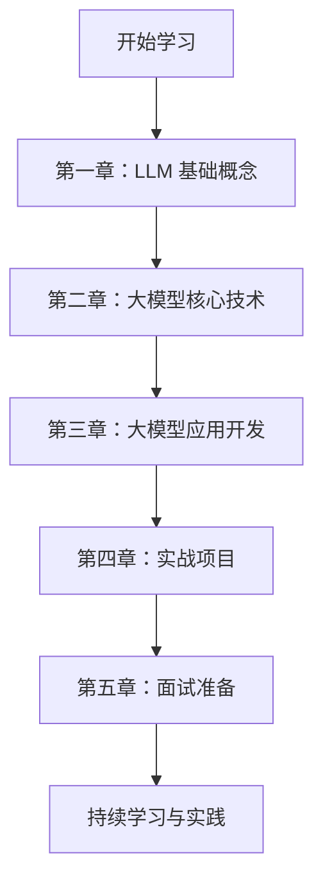

# LLM-NoteBook 学习指南

> 从零开始的大语言模型学习笔记与实践指南

## 📚 项目概述

欢迎来到 LLM-NoteBook！这是一个系统性的 LLM 学习笔记库，旨在帮助大家深入理解大语言模型的原理、应用和开发实践。

### 🎯 学习目标

通过本项目的学习，你将能够：

- **理论基础**：深入理解 Transformer 架构和注意力机制
- **技术掌握**：掌握预训练语言模型的基本原理和训练方法
- **应用实践**：学会使用 RAG、Agent 等前沿技术
- **面试准备**：掌握大模型相关面试题和知识点

### 📖 学习路线

## 🚀 快速导航

### 第一章：LLM 基础概念
- [NLP 基础与 Transformer 架构](./chapter1/README.md)
- [注意力机制详解](./chapter1/attention-mechanism.md)
- [RNN 与 Transformer 对比](./chapter1/rnn-vs-transformer.md)

### 第二章：大模型核心技术
- [KV-Cache 机制](./chapter2/kv-cache.md)
- [前缀缓存优化](./chapter2/prefix-cache.md)
- [训练优化技术](./chapter2/training-optimization.md)

### 第三章：大模型应用开发
- [RAG 检索增强生成](./chapter3/rag-system.md)
- [Agent 智能体开发](./chapter3/agent-development.md)
- [工作流设计](./chapter3/workflow-design.md)

### 第四章：实战项目
- [项目实践案例](./chapter4/project-cases.md)
- [代码示例与最佳实践](./chapter4/code-examples.md)
- [部署与优化](./chapter4/deployment.md)

### 第五章：面试准备
- [面试题整理](./chapter5/interview-questions.md)
- [面经分享](./chapter5/interview-experience.md)
- [知识点总结](./chapter5/knowledge-summary.md)

## 💡 学习建议

### 1. 循序渐进
- 按照章节顺序学习，打好理论基础
- 每个章节都要动手实践代码示例
- 及时总结和复习学过的内容

### 2. 实践为主
- LLM 是一个快速发展的领域，实践比理论更重要
- 多参与开源项目，积累实战经验
- 关注最新技术动态，持续学习

### 3. 社区交流
- 加入相关技术社区，与他人交流学习
- 遇到问题及时寻求帮助
- 分享自己的学习心得和经验

## 📚 推荐资源

### 官方文档
- [OpenAI API 文档](https://platform.openai.com/docs)
- [Anthropic Claude 文档](https://docs.anthropic.com/)
- [Hugging Face Transformers](https://huggingface.co/docs/transformers)

### 学习资源
- [Datawhale Happy-LLM](https://datawhalechina.github.io/happy-llm/)
- [PyTorch 官方教程](https://pytorch.org/tutorials/)
- [LangChain 文档](https://python.langchain.com/)

### 实践项目
- [LLM Universe](https://github.com/datawhalechina/llm-universe)
- [Awesome LLM](https://github.com/Hannibal046/Awesome-LLM)
- [LLM Ops](https://github.com/tensorchord/Awesome-LLMOps)

## 🤝 参与贡献

我们欢迎任何形式的贡献！

- 🐛 **报告问题**：在 GitHub Issues 中提交问题
- 💡 **提出建议**：分享你的想法和改进建议
- 📝 **完善内容**：帮助改进教程和文档
- 🔧 **代码贡献**：提交 Pull Request

## 📞 联系我们

- GitHub：[项目地址](https://github.com/your-username/LLM-NoteBook)
- Issues：[问题反馈](https://github.com/your-username/LLM-NoteBook/issues)
- Discussions：[讨论交流](https://github.com/your-username/LLM-NoteBook/discussions)

---

**让我们一起探索 LLM 的浩瀚世界，创造更多可能！** 🚀 