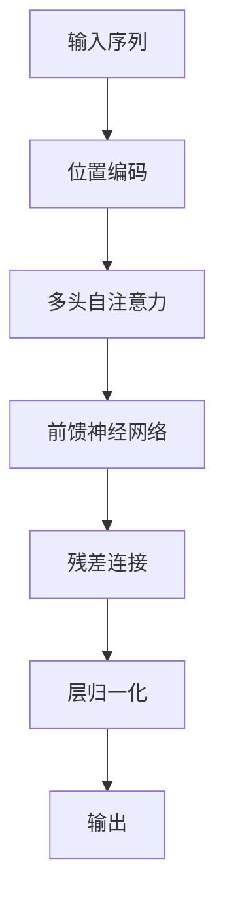

# 第一章：LLM 基础概念

> 从 NLP 基础到 Transformer 架构，深入理解大语言模型的核心原理

## 📚 章节概述

本章将带你从零开始理解大语言模型的基础概念，包括：

- **NLP 发展历程**：从传统方法到深度学习
- **Transformer 架构**：现代大模型的基础
- **注意力机制**：理解模型如何"关注"信息
- **RNN vs Transformer**：架构演进对比

## 🎯 学习目标

通过本章学习，你将能够：

- 理解 NLP 的基本任务和发展历程
- 掌握 Transformer 架构的核心组件
- 深入理解注意力机制的工作原理
- 对比不同架构的优缺点

## 📖 内容导航

| 主题 | 内容 | 状态 |
|------|------|------|
| [NLP 基础与 Transformer 架构](./llm-basics.md) | NLP发展、Transformer原理 | ✅ |
| [注意力机制详解](./attention-mechanism.md) | 自注意力、多头注意力 | ✅ |
| [RNN 与 Transformer 对比](./rnn-vs-transformer.md) | 架构演进、优缺点分析 | ✅ |
| [GPT & BERT 模型解析](./gpt-bert-analysis.md) | 经典模型架构详解 | ✅ |

## 🚀 快速开始

### 前置知识
- 基础的机器学习概念
- Python 编程基础
- 线性代数基础

### 学习建议
1. 先阅读 [NLP 基础与 Transformer 架构](./llm-basics.md) 了解整体背景
2. 深入学习 [注意力机制详解](./attention-mechanism.md) 掌握核心概念
3. 对比学习 [RNN 与 Transformer 对比](./rnn-vs-transformer.md) 理解架构演进
4. 最后学习 [GPT & BERT 模型解析](./gpt-bert-analysis.md) 了解经典模型

## 💡 重点概念

### Transformer 架构

### 注意力机制
- **自注意力**：序列内部的信息交互
- **多头注意力**：从不同角度理解信息
- **位置编码**：保留序列位置信息

## 🔗 相关资源

### 推荐阅读
- [Attention Is All You Need](https://arxiv.org/abs/1706.03762) - Transformer 原始论文
- [The Illustrated Transformer](http://jalammar.github.io/illustrated-transformer/) - 图解 Transformer
- [BERT: Pre-training of Deep Bidirectional Transformers](https://arxiv.org/abs/1810.04805) - BERT 论文

### 实践项目
- [Transformer 实现教程](https://pytorch.org/tutorials/beginner/transformer_tutorial.html)
- [Hugging Face Transformers](https://huggingface.co/docs/transformers/index)

## 📝 学习笔记

在学习过程中，建议你：

1. **动手实践**：尝试实现简单的注意力机制
2. **画图理解**：用图表帮助理解复杂概念
3. **对比学习**：理解不同架构的优缺点
4. **及时总结**：记录学习心得和疑问

## 🎯 下一章预告

在下一章中，我们将深入探讨大模型的核心技术，包括：
- KV-Cache 机制
- 前缀缓存优化
- 训练优化技术

---

**准备好了吗？让我们开始探索 LLM 的奇妙世界！** 🚀 