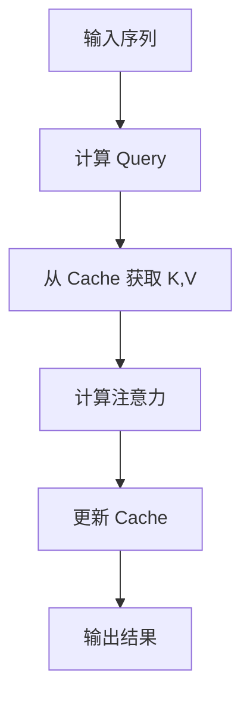

# 第二章：大模型核心技术

> 深入理解大语言模型的核心技术，包括缓存机制、优化策略等

## 📚 章节概述

本章将深入探讨大语言模型的核心技术，包括：

- **KV-Cache 机制**：理解推理过程中的缓存优化
- **前缀缓存优化**：提升长文本处理效率
- **训练优化技术**：模型训练的各种优化策略
- **大模型幻觉问题**：理解与解决方案

## 🎯 学习目标

通过本章学习，你将能够：

- 理解 KV-Cache 的工作原理和实现
- 掌握前缀缓存的使用场景和优化效果
- 了解大模型训练的各种优化技术
- 认识大模型幻觉问题及其解决方案

## 📖 内容导航

| 主题 | 内容 | 状态 |
|------|------|------|
| [KV-Cache 机制详解](./kv-cache.md) | 缓存原理、实现方式、优化效果 | ✅ |
| [前缀缓存优化](./prefix-cache.md) | 前缀缓存、长文本处理、性能提升 | ✅ |
| [大模型幻觉问题](./llm-hallucination.md) | 幻觉成因、检测方法、解决方案 | ✅ |
| [训练优化技术](./training-optimization.md) | 训练策略、优化方法、最佳实践 | ✅ |

## 🚀 快速开始

### 前置知识
- 第一章的 Transformer 基础
- 基础的深度学习概念
- Python 编程基础

### 学习建议
1. 先学习 [KV-Cache 机制详解](./kv-cache.md) 理解推理优化
2. 深入了解 [前缀缓存优化](./prefix-cache.md) 掌握长文本处理
3. 学习 [大模型幻觉问题](./llm-hallucination.md) 了解模型局限性
4. 最后学习 [训练优化技术](./training-optimization.md) 掌握训练技巧

## 💡 重点概念

### KV-Cache 机制

### 前缀缓存优化
- **缓存复用**：相同前缀的缓存可以复用
- **内存优化**：减少重复计算，节省内存
- **性能提升**：显著提升长文本处理速度

## 🔗 相关资源

### 推荐阅读
- [Efficient Memory Management for Large Language Model Serving](https://arxiv.org/abs/2301.03313) - KV-Cache 优化论文
- [Prefix Caching for Large Language Models](https://arxiv.org/abs/2305.10147) - 前缀缓存论文
- [A Survey of Hallucination in Large Language Models](https://arxiv.org/abs/2309.00919) - 幻觉问题综述

### 实践项目
- [vLLM](https://github.com/vllm-project/vllm) - 高性能 LLM 推理框架
- [Flash Attention](https://github.com/Dao-AILab/flash-attention) - 高效注意力机制

## 📝 学习笔记

在学习过程中，建议你：

1. **动手实践**：尝试实现简单的 KV-Cache
2. **性能测试**：对比不同缓存策略的效果
3. **问题分析**：理解幻觉问题的根本原因
4. **优化思考**：思考如何进一步优化模型性能

## 🎯 下一章预告

在下一章中，我们将探讨大模型的应用开发，包括：
- RAG 检索增强生成
- Agent 智能体开发
- 工作流设计

---

**让我们深入探索大模型的核心技术！** 🚀 