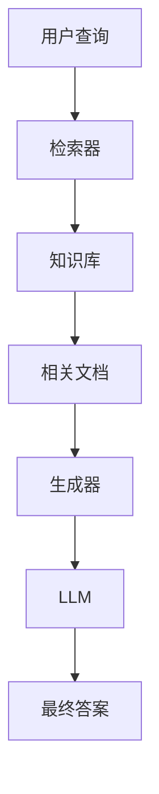

# 第三章：大模型应用开发

> 从 RAG 到 Agent，掌握大模型应用开发的核心技术

## 📚 章节概述

本章将带你深入大模型应用开发的实践领域，包括：

- **RAG 检索增强生成**：结合外部知识提升模型能力
- **Agent 智能体开发**：构建自主决策的智能系统
- **工作流设计**：设计复杂的 AI 应用流程
- **强化学习应用**：在 LLM 中应用强化学习技术

## 🎯 学习目标

通过本章学习，你将能够：

- 理解 RAG 系统的工作原理和实现
- 掌握 Agent 开发的核心概念和框架
- 学会设计复杂的 AI 工作流
- 了解强化学习在 LLM 中的应用

## 📖 内容导航

| 主题 | 内容 | 状态 |
|------|------|------|
| [RAG 检索增强生成](./rag-system.md) | RAG原理、实现方式、最佳实践 | ✅ |
| [Agent 智能体开发](./agent-development.md) | Agent架构、工具使用、决策机制 | ✅ |
| [工作流设计](./workflow-design.md) | 流程设计、状态管理、错误处理 | ✅ |
| [强化学习应用](./reinforcement-learning.md) | RLHF、PPO、奖励设计 | ✅ |

## 🚀 快速开始

### 前置知识
- 前两章的基础知识
- Python 编程基础
- 基础的机器学习概念

### 学习建议
1. 先学习 [RAG 检索增强生成](./rag-system.md) 理解知识增强
2. 深入了解 [Agent 智能体开发](./agent-development.md) 掌握智能体设计
3. 学习 [工作流设计](./workflow-design.md) 了解复杂系统设计
4. 最后学习 [强化学习应用](./reinforcement-learning.md) 掌握模型优化

## 💡 重点概念

### RAG 系统架构

### Agent 系统
- **感知**：接收输入和环境信息
- **思考**：分析情况，制定计划
- **行动**：执行决策，使用工具
- **反思**：评估结果，调整策略

## 🔗 相关资源

### 推荐阅读
- [Retrieval-Augmented Generation for Knowledge-Intensive NLP Tasks](https://arxiv.org/abs/2005.11401) - RAG 原始论文
- [ReAct: Synergizing Reasoning and Acting in Language Models](https://arxiv.org/abs/2210.03629) - ReAct 论文
- [Training language models to follow instructions with human feedback](https://arxiv.org/abs/2203.02155) - RLHF 论文

### 实践框架
- [LangChain](https://python.langchain.com/) - LLM 应用开发框架
- [LangGraph](https://github.com/langchain-ai/langgraph) - 工作流设计框架
- [Dify](https://github.com/langgenius/dify) - 低代码 LLM 应用平台

## 📝 学习笔记

在学习过程中，建议你：

1. **动手实践**：搭建简单的 RAG 系统
2. **项目开发**：开发一个完整的 Agent 应用
3. **流程设计**：设计复杂的工作流
4. **性能优化**：优化应用性能和用户体验

## 🎯 下一章预告

在下一章中，我们将进行实战项目，包括：
- 项目实践案例
- 代码示例与最佳实践
- 部署与优化

---

**让我们开始构建强大的 AI 应用！** 🚀 