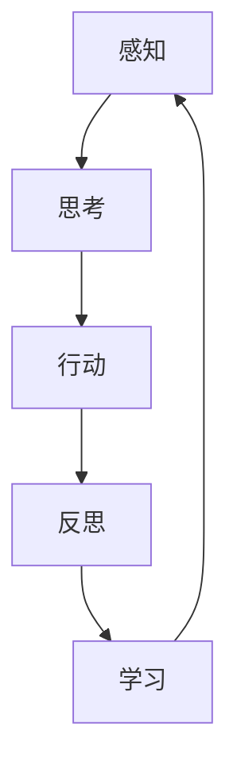

# Agent 智能体开发

> 构建自主决策的智能系统

## 📚 概述

Agent（智能体）是一种能够自主感知环境、制定计划、执行行动的 AI 系统。在大模型时代，Agent 结合了 LLM 的推理能力和工具使用能力，能够完成复杂的任务。

## 🎯 核心概念

### 1. Agent 架构



### 2. 主要组件

#### 2.1 感知模块
- **输入处理**：处理用户输入和环境信息
- **状态识别**：识别当前任务状态
- **上下文管理**：维护对话历史和任务上下文

#### 2.2 思考模块
- **任务分解**：将复杂任务分解为子任务
- **计划制定**：制定执行计划
- **决策推理**：基于当前状态做出决策

#### 2.3 行动模块
- **工具调用**：调用外部工具和 API
- **动作执行**：执行具体的操作
- **结果验证**：验证执行结果

## 🚀 实现方式

### 1. 基础 Agent 实现

```python
from langchain.agents import initialize_agent, Tool
from langchain.llms import OpenAI

# 定义工具
tools = [
    Tool(
        name="Search",
        func=search_function,
        description="用于搜索网络信息"
    ),
    Tool(
        name="Calculator",
        func=calculator_function,
        description="用于数学计算"
    )
]

# 初始化 Agent
agent = initialize_agent(
    tools,
    llm,
    agent="zero-shot-react-description",
    verbose=True
)

# 执行任务
result = agent.run("帮我计算今天的天气如何？")
```

### 2. 高级 Agent 技术

#### 2.1 ReAct 模式
```python
def react_agent(query):
    # 思考阶段
    thought = llm.generate(f"思考如何解决：{query}")
    
    # 行动阶段
    action = llm.generate(f"基于思考，我需要采取什么行动？")
    
    # 观察阶段
    observation = execute_action(action)
    
    # 反思阶段
    reflection = llm.generate(f"基于观察结果，我需要调整什么？")
    
    return final_answer
```

#### 2.2 多 Agent 协作
```python
class MultiAgentSystem:
    def __init__(self):
        self.agents = {
            "planner": PlanningAgent(),
            "executor": ExecutionAgent(),
            "reviewer": ReviewAgent()
        }
    
    def execute_task(self, task):
        # 规划阶段
        plan = self.agents["planner"].create_plan(task)
        
        # 执行阶段
        result = self.agents["executor"].execute_plan(plan)
        
        # 审查阶段
        final_result = self.agents["reviewer"].review_result(result)
        
        return final_result
```

## 🔗 相关资源

### 推荐阅读
- [ReAct: Synergizing Reasoning and Acting in Language Models](https://arxiv.org/abs/2210.03629) - ReAct 论文
- [Toolformer: Language Models Can Teach Themselves to Use Tools](https://arxiv.org/abs/2302.04761) - Toolformer 论文
- [AutoGPT: An Autonomous GPT-4 Experiment](https://github.com/Significant-Gravitas/Auto-GPT) - AutoGPT 项目

### 实践框架
- [LangChain](https://python.langchain.com/) - Agent 开发框架
- [LangGraph](https://github.com/langchain-ai/langgraph) - 工作流框架
- [AutoGen](https://github.com/microsoft/autogen) - 微软的多 Agent 框架

## 📝 最佳实践

### 1. 工具设计
- **功能明确**：每个工具功能单一明确
- **接口统一**：统一的输入输出格式
- **错误处理**：完善的错误处理机制

### 2. 提示工程
- **角色定义**：明确 Agent 的角色和能力
- **任务描述**：清晰的任务描述和约束
- **示例引导**：提供具体的示例

### 3. 安全控制
- **权限管理**：限制 Agent 的权限范围
- **行为监控**：监控 Agent 的行为
- **人工干预**：必要时的人工干预机制

## 🎯 应用场景

### 1. 自动化助手
- 个人助理
- 客服机器人
- 技术支持

### 2. 工作流自动化
- 数据处理
- 报告生成
- 任务调度

### 3. 创意协作
- 内容创作
- 设计辅助
- 代码开发

## 🎯 总结

Agent 技术正在快速发展，结合大语言模型的能力，可以构建出强大的智能系统。关键是要合理设计架构，确保系统的可靠性和安全性。

---

**让 AI 成为你的智能助手！** 🚀 