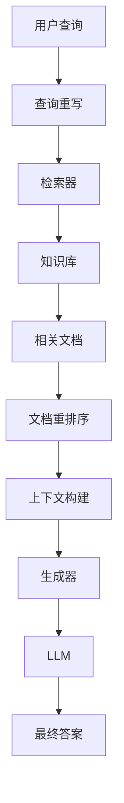

# RAG 检索增强生成

> 结合外部知识提升大语言模型的能力

## 📚 概述

RAG (Retrieval-Augmented Generation) 是一种结合检索和生成的架构，通过从外部知识库检索相关信息来增强大语言模型的生成能力。

## 🎯 核心概念

### 1. RAG 架构



### 2. 主要组件

#### 2.1 检索器 (Retriever)
- **密集检索**：使用向量相似度搜索
- **稀疏检索**：使用关键词匹配
- **混合检索**：结合多种检索方法

#### 2.2 生成器 (Generator)
- **大语言模型**：如 GPT、Claude 等
- **上下文注入**：将检索到的文档注入到提示中
- **答案生成**：基于检索内容生成答案

## 🚀 实现方式

### 1. 基础 RAG 实现

```python
from langchain.retrievers import VectorstoreRetriever
from langchain.llms import OpenAI
from langchain.chains import RetrievalQA

# 创建检索器
retriever = VectorstoreRetriever.from_documents(documents)

# 创建 LLM
llm = OpenAI()

# 创建 RAG 链
qa_chain = RetrievalQA.from_chain_type(
    llm=llm,
    chain_type="stuff",
    retriever=retriever
)

# 查询
answer = qa_chain.run("你的问题")
```

### 2. 高级 RAG 技术

#### 2.1 查询重写
```python
def rewrite_query(query):
    # 使用 LLM 重写查询以更好地匹配文档
    prompt = f"重写以下查询以更好地检索相关信息：{query}"
    return llm.generate(prompt)
```

#### 2.2 文档重排序
```python
def rerank_documents(query, documents):
    # 使用交叉编码器重新排序文档
    scores = cross_encoder.predict([(query, doc) for doc in documents])
    return sorted(zip(documents, scores), key=lambda x: x[1], reverse=True)
```

## 🔗 相关资源

### 推荐阅读
- [Retrieval-Augmented Generation for Knowledge-Intensive NLP Tasks](https://arxiv.org/abs/2005.11401) - RAG 原始论文
- [REPLUG: Retrieval-Augmented Black-Box Language Models](https://arxiv.org/abs/2301.12652) - REPLUG 论文
- [Atlas: Few-shot Learning with Retrieval Augmented Language Models](https://arxiv.org/abs/2208.03299) - Atlas 论文

### 实践框架
- [LangChain](https://python.langchain.com/) - RAG 应用开发框架
- [LlamaIndex](https://github.com/jerryjliu/llama_index) - 数据框架
- [Haystack](https://github.com/deepset-ai/haystack) - 端到端框架

## 📝 最佳实践

### 1. 知识库构建
- **文档预处理**：清理和标准化文档
- **分块策略**：选择合适的文档分块大小
- **元数据管理**：添加有用的元数据

### 2. 检索优化
- **混合检索**：结合密集和稀疏检索
- **查询扩展**：使用同义词和相关词
- **重排序**：使用更精确的重排序模型

### 3. 生成优化
- **提示工程**：设计有效的提示模板
- **上下文长度**：合理控制上下文长度
- **答案验证**：验证生成答案的准确性

## 🎯 应用场景

### 1. 问答系统
- 企业知识库问答
- 技术支持系统
- 教育辅导系统

### 2. 文档分析
- 法律文档分析
- 医疗报告分析
- 学术论文分析

### 3. 个性化推荐
- 内容推荐
- 产品推荐
- 服务推荐

## 🎯 总结

RAG 是一种强大的技术，能够显著提升大语言模型的能力。通过合理的设计和优化，可以构建出高质量的 RAG 系统。

---

**让知识检索为 AI 赋能！** 🚀 