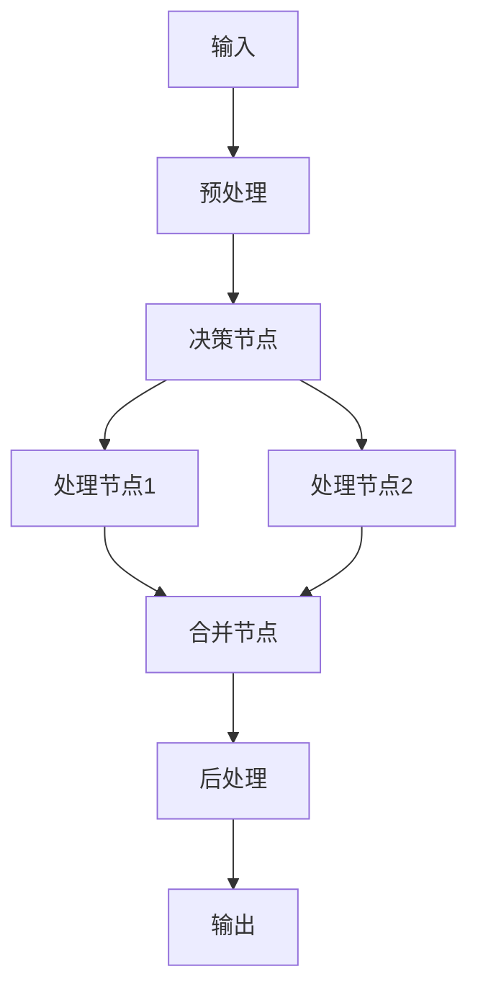

# 工作流设计

> 设计复杂的 AI 应用流程

## 📚 概述

工作流设计是构建复杂 AI 应用的核心技术，通过合理设计流程，可以实现复杂的业务逻辑和自动化处理。

## 🎯 核心概念

### 1. 工作流架构



### 2. 主要组件

#### 2.1 节点类型
- **输入节点**：接收外部输入
- **处理节点**：执行具体处理逻辑
- **决策节点**：根据条件进行分支
- **合并节点**：合并多个分支的结果
- **输出节点**：输出最终结果

#### 2.2 流程控制
- **顺序执行**：按顺序执行节点
- **并行执行**：同时执行多个节点
- **条件分支**：根据条件选择执行路径
- **循环执行**：重复执行某些节点

## 🚀 实现方式

### 1. 基础工作流实现

```python
from langchain.graphs import StateGraph
from langchain.schema import BaseMessage

# 定义状态
class WorkflowState:
    def __init__(self):
        self.messages = []
        self.data = {}
        self.status = "pending"

# 定义节点函数
def input_processor(state: WorkflowState):
    # 处理输入
    state.data["processed_input"] = process_input(state.messages[-1])
    return state

def decision_maker(state: WorkflowState):
    # 决策逻辑
    if condition_met(state.data):
        return "path_a"
    else:
        return "path_b"

def processor_a(state: WorkflowState):
    # 处理路径 A
    state.data["result"] = process_a(state.data["processed_input"])
    return state

def processor_b(state: WorkflowState):
    # 处理路径 B
    state.data["result"] = process_b(state.data["processed_input"])
    return state

# 创建工作流
workflow = StateGraph(WorkflowState)

# 添加节点
workflow.add_node("input", input_processor)
workflow.add_node("decision", decision_maker)
workflow.add_node("process_a", processor_a)
workflow.add_node("process_b", processor_b)

# 添加边
workflow.add_edge("input", "decision")
workflow.add_conditional_edges("decision", {
    "path_a": "process_a",
    "path_b": "process_b"
})

# 编译工作流
app = workflow.compile()
```

### 2. 高级工作流技术

#### 2.1 错误处理
```python
def error_handler(state: WorkflowState, error: Exception):
    # 错误处理逻辑
    state.data["error"] = str(error)
    state.status = "error"
    return state

# 添加错误处理
workflow.add_node("error_handler", error_handler)
workflow.add_edge("process_a", "error_handler")
workflow.add_edge("process_b", "error_handler")
```

#### 2.2 并行处理
```python
from concurrent.futures import ThreadPoolExecutor

def parallel_processor(state: WorkflowState):
    # 并行处理多个任务
    with ThreadPoolExecutor() as executor:
        futures = [
            executor.submit(process_task, task)
            for task in state.data["tasks"]
        ]
        results = [future.result() for future in futures]
    state.data["results"] = results
    return state
```

## 🔗 相关资源

### 推荐阅读
- [LangGraph: Stateful Graphs for LLM Applications](https://github.com/langchain-ai/langgraph) - LangGraph 文档
- [Workflow Patterns](https://www.workflowpatterns.com/) - 工作流模式
- [BPMN 2.0](https://www.omg.org/spec/BPMN/2.0/) - 业务流程建模

### 实践框架
- [LangGraph](https://github.com/langchain-ai/langgraph) - LangChain 的工作流框架
- [Prefect](https://github.com/PrefectHQ/prefect) - 数据工作流框架
- [Airflow](https://github.com/apache/airflow) - Apache 工作流框架

## 📝 最佳实践

### 1. 设计原则
- **模块化**：将复杂流程分解为简单模块
- **可重用**：设计可重用的组件
- **可测试**：确保每个节点都可以独立测试
- **可监控**：添加监控和日志记录

### 2. 性能优化
- **并行化**：合理使用并行处理
- **缓存**：缓存中间结果
- **资源管理**：合理管理计算资源
- **负载均衡**：平衡各节点的负载

### 3. 错误处理
- **异常捕获**：捕获和处理异常
- **重试机制**：实现自动重试
- **降级策略**：提供降级方案
- **监控告警**：及时发现问题

## 🎯 应用场景

### 1. 数据处理流程
- 数据清洗
- 特征工程
- 模型训练
- 结果评估

### 2. 业务流程自动化
- 订单处理
- 审批流程
- 报告生成
- 通知发送

### 3. AI 应用流程
- 多轮对话
- 任务分解
- 结果验证
- 反馈学习

## 🎯 总结

工作流设计是构建复杂 AI 应用的重要技术。通过合理的设计和优化，可以构建出高效、可靠的工作流系统。

---

**让工作流为 AI 应用赋能！** 🚀 