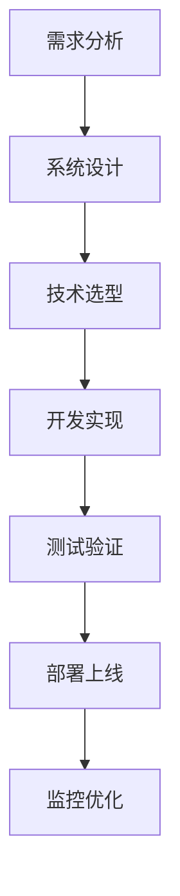

# 第四章：实战项目

> 从理论到实践，通过真实项目掌握大模型应用开发

## 📚 章节概述

本章将通过实际项目案例，带你深入大模型应用开发的实战领域，包括：

- **项目实践案例**：真实项目的设计与实现
- **代码示例与最佳实践**：高质量的代码实现
- **部署与优化**：生产环境的部署策略
- **AI 应用开发路线**：完整的学习路径

## 🎯 学习目标

通过本章学习，你将能够：

- 掌握大模型应用开发的完整流程
- 学会设计和实现复杂的 AI 应用
- 了解生产环境的部署和优化策略
- 建立完整的 AI 应用开发知识体系

## 📖 内容导航

| 主题 | 内容 | 状态 |
|------|------|------|
| [项目实践案例](./project-cases.md) | 真实项目、设计思路、实现方案 | ✅ |
| [代码示例与最佳实践](./code-examples.md) | 代码实现、设计模式、最佳实践 | ✅ |
| [部署与优化](./deployment.md) | 部署策略、性能优化、监控运维 | ✅ |
| [AI 应用开发路线](./ai-development-roadmap.md) | 学习路径、技术栈、发展方向 | ✅ |

## 🚀 快速开始

### 前置知识
- 前三章的基础知识
- Python 编程基础
- 基础的软件工程知识

### 学习建议
1. 先了解 [AI 应用开发路线](./ai-development-roadmap.md) 建立整体认知
2. 学习 [项目实践案例](./project-cases.md) 理解项目设计思路
3. 深入研究 [代码示例与最佳实践](./code-examples.md) 掌握实现技巧
4. 最后学习 [部署与优化](./deployment.md) 了解生产环境要求

## 💡 重点概念

### 项目开发流程

### 技术栈选择
- **框架选择**：LangChain、Dify、自定义框架
- **模型选择**：开源模型 vs 商业 API
- **部署方式**：云服务、自建服务器、边缘计算

## 🔗 相关资源

### 推荐项目
- [MultiAgents DeepResearch](https://github.com/bytedance/deer-flow) - 多智能体研究框架
- [LLM Ops](https://github.com/tensorchord/Awesome-LLMOps) - LLM 运维最佳实践
- [Agent 模版](https://github.com/LofiSu/gemini-fullstack-langgraph-quickstart) - 快速开始模板

### 学习资源
- [Anthropic Cookbook](https://github.com/anthropics/anthropic-cookbook) - Anthropic 官方示例
- [OpenAI Cookbook](https://github.com/openai/openai-cookbook) - OpenAI 官方示例
- [Dify Workflow](https://github.com/svcvit/Awesome-Dify-Workflow) - Dify 工作流示例

## 📝 学习笔记

在学习过程中，建议你：

1. **项目实践**：选择一个感兴趣的项目进行实践
2. **代码复现**：尝试复现书中的代码示例
3. **性能测试**：对比不同实现方案的性能
4. **经验总结**：记录开发过程中的经验和教训

## 🎯 下一章预告

在下一章中，我们将进行面试准备，包括：
- 面试题整理
- 面经分享
- 知识点总结

---

**让我们通过实战项目来巩固所学知识！** 🚀 