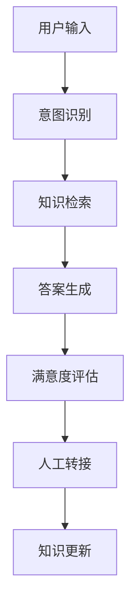
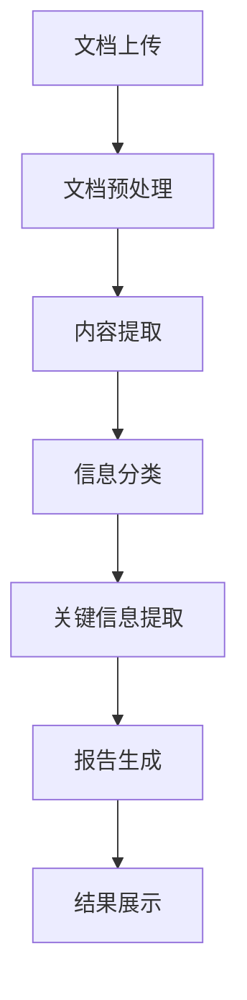
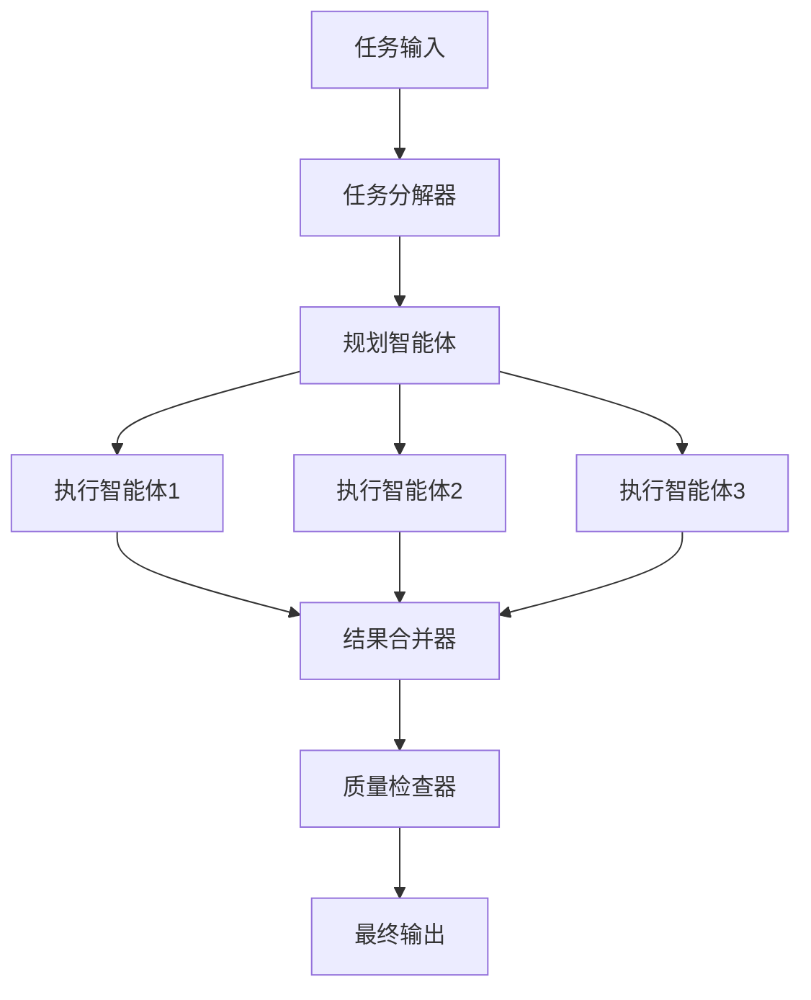

# 项目实践案例

> 真实项目的设计与实现

## 📚 概述

本章将通过实际的项目案例，展示大模型应用开发的完整流程，从需求分析到部署上线。

## 🎯 项目案例

### 1. 智能客服系统

#### 1.1 项目背景
- **需求**：为企业构建智能客服系统，提供 24/7 在线服务
- **目标**：提高客服效率，降低人工成本
- **技术栈**：RAG + Agent + 工作流

#### 1.2 系统架构


#### 1.3 核心实现
```python
class CustomerServiceAgent:
    def __init__(self):
        self.intent_classifier = IntentClassifier()
        self.knowledge_base = KnowledgeBase()
        self.llm = OpenAI()
        self.satisfaction_analyzer = SatisfactionAnalyzer()
    
    def process_query(self, user_input):
        # 意图识别
        intent = self.intent_classifier.classify(user_input)
        
        # 知识检索
        if intent == "product_inquiry":
            context = self.knowledge_base.search_products(user_input)
        elif intent == "technical_support":
            context = self.knowledge_base.search_solutions(user_input)
        else:
            context = self.knowledge_base.search_general(user_input)
        
        # 答案生成
        response = self.llm.generate(
            prompt=f"基于以下信息回答用户问题：{context}\n用户问题：{user_input}"
        )
        
        # 满意度评估
        satisfaction = self.satisfaction_analyzer.analyze(user_input, response)
        
        if satisfaction < 0.7:
            return self.escalate_to_human(user_input, response)
        
        return response
```

### 2. 文档智能分析系统

#### 2.1 项目背景
- **需求**：自动分析大量文档，提取关键信息
- **目标**：提高文档处理效率，减少人工工作量
- **技术栈**：RAG + 多模态 + 工作流

#### 2.2 系统架构


#### 2.3 核心实现
```python
class DocumentAnalyzer:
    def __init__(self):
        self.preprocessor = DocumentPreprocessor()
        self.extractor = ContentExtractor()
        self.classifier = DocumentClassifier()
        self.summarizer = DocumentSummarizer()
        self.report_generator = ReportGenerator()
    
    def analyze_document(self, document_path):
        # 文档预处理
        processed_doc = self.preprocessor.process(document_path)
        
        # 内容提取
        content = self.extractor.extract(processed_doc)
        
        # 文档分类
        doc_type = self.classifier.classify(content)
        
        # 关键信息提取
        if doc_type == "contract":
            key_info = self.extract_contract_info(content)
        elif doc_type == "report":
            key_info = self.extract_report_info(content)
        else:
            key_info = self.extract_general_info(content)
        
        # 报告生成
        report = self.report_generator.generate(key_info, doc_type)
        
        return report
```

### 3. 多智能体协作系统

#### 3.1 项目背景
- **需求**：构建多个智能体协作完成复杂任务
- **目标**：实现任务分解和并行处理
- **技术栈**：多 Agent + 工作流 + 通信机制

#### 3.2 系统架构


#### 3.3 核心实现
```python
class MultiAgentSystem:
    def __init__(self):
        self.task_decomposer = TaskDecomposer()
        self.planner_agent = PlannerAgent()
        self.executor_agents = {
            "research": ResearchAgent(),
            "analysis": AnalysisAgent(),
            "writing": WritingAgent()
        }
        self.result_merger = ResultMerger()
        self.quality_checker = QualityChecker()
    
    def execute_complex_task(self, task):
        # 任务分解
        subtasks = self.task_decomposer.decompose(task)
        
        # 任务规划
        execution_plan = self.planner_agent.create_plan(subtasks)
        
        # 并行执行
        results = {}
        for agent_name, subtask in execution_plan.items():
            agent = self.executor_agents[agent_name]
            results[agent_name] = agent.execute(subtask)
        
        # 结果合并
        merged_result = self.result_merger.merge(results)
        
        # 质量检查
        final_result = self.quality_checker.check(merged_result)
        
        return final_result
```

## 🔗 相关资源

### 推荐项目
- [MultiAgents DeepResearch](https://github.com/bytedance/deer-flow) - 多智能体研究框架
- [AutoGPT](https://github.com/Significant-Gravitas/Auto-GPT) - 自主 GPT 实验
- [BabyAGI](https://github.com/yoheinakajima/babyagi) - 任务管理智能体

### 学习资源
- [LangChain 示例](https://github.com/langchain-ai/langchain/tree/master/examples)
- [Hugging Face 示例](https://github.com/huggingface/transformers/tree/main/examples)

## 📝 最佳实践

### 1. 项目设计
- **需求分析**：深入理解用户需求
- **技术选型**：选择合适的技术栈
- **架构设计**：设计可扩展的架构
- **原型验证**：快速验证核心功能

### 2. 开发流程
- **迭代开发**：采用敏捷开发方法
- **代码质量**：注重代码质量和可维护性
- **测试覆盖**：确保充分的测试覆盖
- **文档完善**：编写详细的文档

### 3. 部署运维
- **环境管理**：管理开发、测试、生产环境
- **监控告警**：建立完善的监控体系
- **性能优化**：持续优化系统性能
- **安全防护**：确保系统安全

## 🎯 总结

通过实际项目案例的学习，可以更好地理解大模型应用开发的完整流程。关键是要在实践中不断总结经验，持续改进。

---

**实践出真知，让我们开始构建！** 🚀 