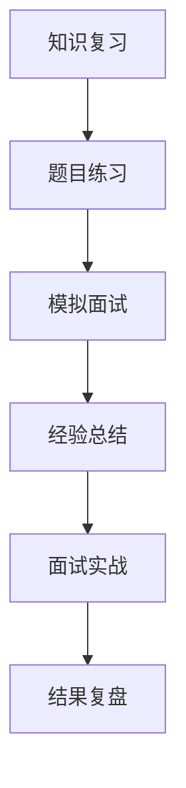

# 第五章：面试准备

> 系统整理大模型相关面试题，助你顺利通过技术面试

## 📚 章节概述

本章将系统整理大模型相关的面试题和知识点，帮助你：

- **面试题整理**：常见面试题分类整理
- **面经分享**：真实面试经验分享
- **知识点总结**：核心知识点系统梳理
- **AI 一百题**：经典 AI 面试题集

## 🎯 学习目标

通过本章学习，你将能够：

- 掌握大模型面试的核心知识点
- 了解常见面试题的答题思路
- 学习真实面试的经验和技巧
- 建立完整的面试知识体系

## 📖 内容导航

| 主题 | 内容 | 状态 |
|------|------|------|
| [面试题整理](./interview-questions.md) | 常见面试题、答题思路、知识点 | ✅ |
| [面经分享](./interview-experience.md) | 真实面经、面试技巧、经验总结 | ✅ |
| [知识点总结](./knowledge-summary.md) | 核心概念、技术要点、重点难点 | ✅ |
| [AI 一百题](./ai-hundred-questions.md) | 经典 AI 面试题、详细解析 | ✅ |

## 🚀 快速开始

### 前置知识
- 前四章的完整知识体系
- 基础的计算机科学知识
- 良好的表达和沟通能力

### 学习建议
1. 先学习 [知识点总结](./knowledge-summary.md) 巩固理论基础
2. 练习 [面试题整理](./interview-questions.md) 掌握答题技巧
3. 阅读 [面经分享](./interview-experience.md) 了解面试流程
4. 挑战 [AI 一百题](./ai-hundred-questions.md) 检验学习效果

## 💡 重点概念

### 面试准备流程

### 面试重点领域
- **理论基础**：Transformer、注意力机制、训练方法
- **技术实践**：RAG、Agent、模型优化
- **系统设计**：架构设计、性能优化、部署方案
- **前沿动态**：最新技术、发展趋势、应用场景

## 🔗 相关资源

### 面试资源
- [LLM 面试题合集](https://wdndev.github.io/llm_interview_note/#/) - 系统性的面试题整理
- [AI 面试八股文](https://wdndev.github.io/ai_interview_note/#/) - AI 面试知识点
- [大模型应用开发](https://github.com/datawhalechina/llm-universe) - 实践项目参考

### 学习资源
- [Datawhale Happy-LLM](https://datawhalechina.github.io/happy-llm/) - 理论基础学习
- [PyTorch 教程](https://datawhalechina.github.io/thorough-pytorch/) - 深度学习基础

## 📝 学习笔记

在面试准备过程中，建议你：

1. **系统复习**：按照知识点体系进行系统复习
2. **题目练习**：多做面试题，掌握答题技巧
3. **模拟面试**：进行模拟面试，提高应变能力
4. **经验总结**：记录面试经验，不断改进

## 🎯 学习建议

### 面试准备策略
- **理论扎实**：确保基础概念理解透彻
- **实践丰富**：准备具体的项目经验
- **表达清晰**：练习清晰的技术表达
- **心态平和**：保持积极的学习心态

### 常见面试类型
- **技术面试**：重点考察技术深度
- **项目面试**：重点考察实践经验
- **系统设计**：重点考察架构能力
- **行为面试**：重点考察软技能

---

**祝你面试顺利，成功获得心仪的 offer！** 🎉 